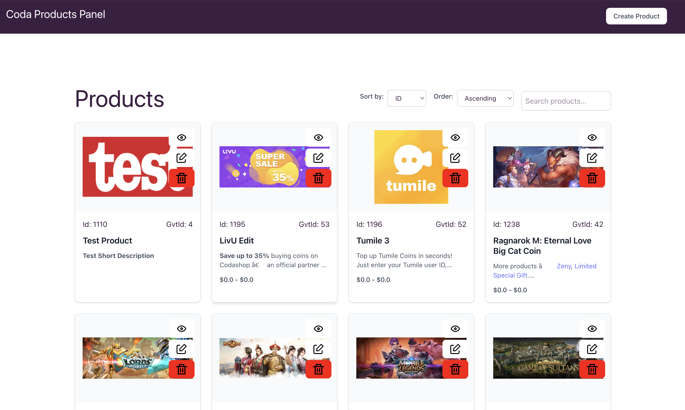

## Project Overview

The **Coda Product Editor** is a web application designed to manage products as per Coda Take Home task guidlines. It provides a complete CRUD interface for product management with validation, search, pagination (with infinite scroll), and sorting functionalities, and responsive design.

You can access Quick Preview on: https://codaproducteditorfrontend-production.up.railway.app/

### Key Features

- **Product Management**: Complete CRUD operations for products
- **Advanced Filtering**: Search functionality across Name and Title fields, sorting on ID, name, and gvtId by both asc and descending, and paginated request handling for product listing
- **Form Validation**: Comprehensive client-side and server-side validation using Zod
- **Responsive Design**: Modern UI built with Vue.js and Tailwind CSS
- **Modern UX**: Clean, intuitive, and consistent interface with proper loading states and error handling
- **Test Coverage**: Comprehensive test suite with Vitest for both frontend and backend

## Architecture

This is a **monorepo** containing two main applications, frontend and backend. It has been set as a monoRepo workspace.

## Project Structure

```
CodaProductEditor/
├── frontend/                 # Vue.js frontend application
│   ├── src/
│   │   ├── components/      # Reusable UI components
│   │   ├── features/        # Feature-based modules
│   │   │   └── products/    # Product management feature
│   │   │       ├── api/     # API layer and composables
│   │   │       ├── components/ # Product-specific components
│   │   │       ├── pages/   # Route components
│   │   │       ├── testing/ # Mock data and test utilities
│   │   │       └── types.ts # TypeScript definitions
│   │   ├── lib/            # Shared utilities and HTTP client
│   │   ├── router/         # Vue Router configuration
│   │   └── config/         # Environment configuration
│   ├── public/             # Static public assets
│   └── package.json
├── backend/                  # Koa.js backend API
│   ├── src/
│   │   ├── http/           # HTTP routes and controllers
│   │   ├── service/        # Business logic layer
│   │   ├── repository/     # Data access layer
│   │   ├── utils/          # Utility functions
│   │   ├── types/          # TypeScript definitions
│   │   └── config/         # Environment configuration
│   ├── data/               # JSON data storage
│   └── package.json
├── .gitignore              # Git ignore rules
└── package.json            # Root package with workspace config
```

### Environment & Configuration

#### Environment Variables

The application uses environment variables for configuration. Create the following files as needed:

**Frontend (.env.local or .env)**

```bash
VITE_API_URL=http://localhost:3001
```

**Backend (.env)**

```bash
PORT=3001
```

### Frontend (`@codaproducteditor/frontend`)

- **Framework**: Vue.js 3 with Composition API
- **Language**: TypeScript
- **Styling**: Tailwind CSS
- **Routing**: Vue Router
- **Build Tool**: Vite
- **Testing**: Vitest with Vue Test Utils
- **Validation**: Zod schemas for form validation

### Backend (`@codaproducteditor/backend`)

- **Framework**: Koa.js with TypeScript
- **Validation**: Zod for request/response validation
- **Testing**: Vitest with Supertest
- **Data Storage**: File-based JSON database
- **Development**: tsx for hot reloading

### Development Tools

- **Concurrently** - Run multiple commands concurrently to handle monorepo

## Quick Start

### Prerequisites

- **Node.js** >= 18.0.0
- **npm** >= 8.0.0

### Installation and Running the application

**Install all dependencies**

```bash
npm run install:all
```

**Start development servers**

```bash
npm run dev
```

This will start:

- Backend API server on `http://localhost:3001`
- Frontend development server on `http://localhost:5173`

OR

**Start Production Server**

**Build**

```bash
npm run build
```

**Start**

```bash
npm run start
```

This will start:

- Backend API server on `http://localhost:3001`
- Frontend development server on `http://localhost:4173`

## Development

### Available Scripts

| Command                | Description                                         |
| ---------------------- | --------------------------------------------------- |
| `npm run dev`          | Start both frontend and backend in development mode |
| `npm run dev:backend`  | Start only the backend server                       |
| `npm run dev:frontend` | Start only the frontend development server          |
| `npm run build`        | Build both applications for production              |
| `npm run test`         | Run all tests (backend + frontend)                  |
| `npm run clean`        | Clean all node_modules and build artifacts          |
| `npm run install:all`  | Install dependencies for all workspaces             |

## Testing

### Run All Tests

```bash
npm run test
```

### Test Coverage

- **Backend**: Comprehensive test coverage for all layers (HTTP, Service, Repository)
- **Frontend**: Component tests, API tests, and integration tests

## API Endpoints

The backend provides a RESTful API with the following endpoints:

| Method   | Endpoint            | Description                     |
| -------- | ------------------- | ------------------------------- |
| `GET`    | `/api/products`     | Get all products (with options) |
| `GET`    | `/api/products/:id` | Get product by ID               |
| `POST`   | `/api/products`     | Create new product              |
| `PATCH`  | `/api/products/:id` | Update existing product         |
| `DELETE` | `/api/products/:id` | Delete product                  |

### Example API Usage

```bash
# Get products with options
curl http://localhost:3001/api/products

# Get specific product
curl http://localhost:3001/api/products/1

# Create new product
curl -X POST http://localhost:3001/api/products \
  -H "Content-Type: application/json" \
  -d '{"name": "New Product", "gvtId": 1009, ...}'
```

## User Interface

The application provides a modern, responsive interface with:

- **Product List**: Visual cards displaying all products
  - **Infinite Scroll**: Automatically loads more products as you scroll down
  - **Real-time Search**: Live search functionality that filters products by name as you type
  - **Advanced Sorting**: Sort products by ID, name, or gvtId in ascending or descending order
- **Product Details**: Comprehensive product information page
- **Form Editor**: Full-featured form for creating/editing products
- **Validation**: Real-time form validation with helpful error messages
- **Loading States**: Proper loading indicators and error handling
- **Responsive Design**: Works seamlessly on desktop and mobile

## Screenshots

### Product List



### Product List Filters


### Product Details


### Edit Product Details


### Create Product


### Create Product Result


